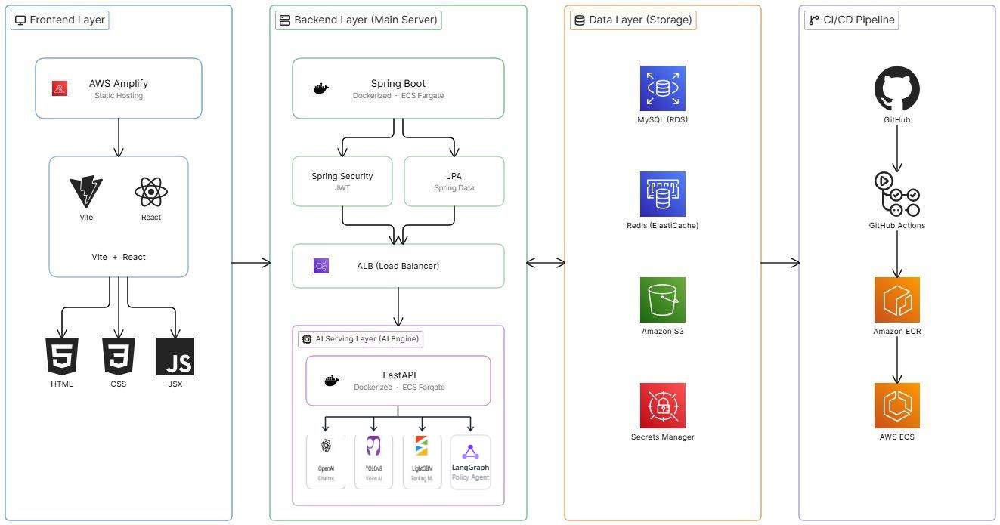
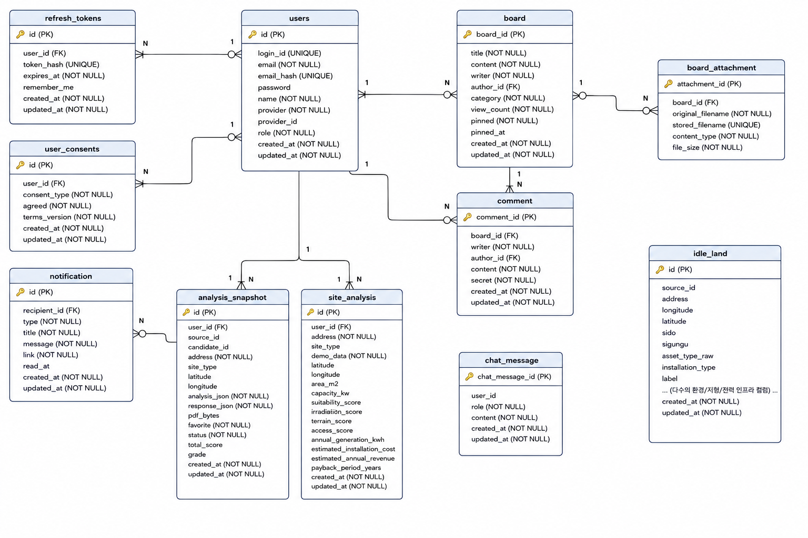

# SolarAivle Backend

AI 기반 유휴공간 태양광 설치 우선순위 분석 서비스 — **백엔드 서버**

KT AIVLE BIG PROJECT · AI_07반_19조

> 전체 프로젝트 소개는 [프론트 레포](링크)를 참고해주세요. 이 문서는 백엔드 서버(Spring Boot)에 대한 설명입니다.

---

## 이 서버가 하는 일

- 회원 인증/인가 (JWT, Google OAuth 2.0, 이메일 인증)
- 유휴부지 후보지 조회 및 분석 요청 처리
- Vision AI · Ranking ML · Policy Agent 서버 간 순차 오케스트레이션
- 분석 결과 저장 및 PDF 보고서 생성
- 커뮤니티(공지사항·FAQ·1:1 문의), 회원 관리, 분석 이력 관리

## 기술 스택

- **Framework**: Spring Boot 4.1, Spring Security, Spring Data JPA (Java 17)
- **DB**: MySQL (RDS)
- **Cache**: Redis (ElastiCache) — 이메일 인증코드, 로그인 잠금 상태 저장
- **인증**: JWT (Access/Refresh Token), Google OAuth 2.0
- **인프라**: AWS ECS Fargate, ALB, CloudFront, S3, Secrets Manager
- **CI/CD**: GitHub Actions (OIDC 기반 AWS 인증)
- **모니터링**: CloudWatch 대시보드 + 알람(CPU/Memory/LiveTaskCount), SNS 이메일 알림

## 아키텍처에서 이 서버의 위치

SolarAivle은 5개 ECS Fargate 서비스로 구성됩니다. 이 백엔드는 Ranking ML·Vision AI·Policy Agent 3개를 내부적으로 순차 오케스트레이션하며, Chatbot은 ALB에서 별도 경로로 직접 라우팅되어 백엔드를 거치지 않습니다.

```
React (Frontend)
      │
      ▼
     ALB
      │
      ├─▶ Spring Boot (Backend) ──▶ Ranking ML (FastAPI, LightGBM+SHAP)
      │         │                ──▶ Vision AI (FastAPI, YOLOv8m-seg)
      │         │                ──▶ Policy Agent (FastAPI, LangGraph)
      │         ▼
      │      MySQL / Redis
      │
      └─▶ Chatbot (FastAPI) — 백엔드 미경유, ALB에서 직접 라우팅
```

처리 흐름: 분석 요청 시 Ranking ML 호출 → 점수·등급·우선순위 산출 → 상세분석 선택 시 Vision AI 호출 → 실시간 위성 이미지 기반 패널 설치 영역 분석 → Policy Agent 호출 → 지원사업 매칭 및 설명 생성 → 결과 병합 후 저장.



## ERD



## API

전체 API는 JWT 기반 인증(`Authorization: Bearer {accessToken}`)을 사용하며,
모든 응답은 `{ success, message, data }` 공통 포맷을 따릅니다.

| 기능 영역 | Base Path | 인증 |
|---|---|---|
| 인증/회원가입/로그인 | `/auth` | 공개 |
| 마이페이지/약관 동의 | `/users/me`, `/users/me/consents` | 로그인 필요 |
| 약관 조회 | `/terms` | 공개 |
| 게시판 (공지/FAQ/1:1문의) | `/boards` | 조회는 공개, 작성/수정/삭제는 로그인 필요 |
| 댓글 | `/boards/{id}/comments`, `/comments` | 조회는 공개, 작성/수정/삭제는 로그인 필요 |
| 유휴부지 검색 | `/idle-lands` | 공개 |
| 대시보드/부지 분석 | `/dashboard` | 공개 (분석 이력 저장·조회는 로그인 시) |
| 분석 이력 관리 | `/analysis-history` | 로그인 필요 |
| 리포트 PDF 생성 | `/pdf` | 공개 |
| 알림 | `/notifications` | 로그인 필요 |
| 관리자 기능 (회원/유휴부지/분석로그 관리) | `/admin` | 관리자 권한 필요 |

상세 엔드포인트 스펙은 필요 시 컨트롤러 코드(`src/main/java/com/example/demo/**/controller/`) 참고.

## 보안

- `@Valid` + DTO 기반 요청 형식 검증 — 형식에 맞지 않는 요청은 400 에러로 즉시 차단
- `JpaRepository` 기반 CRUD, 파라미터 바인딩(`:param`)만 사용 — 의도치 않은 쿼리 실행 방지
- JWT 시크릿 키 등 민감정보는 전부 환경변수로 관리, 소스코드 하드코딩 금지
- 계정 잠금: 로그인 5회 실패 시 단계별 잠금(5분 → 15분 → 30분)
- 개인정보(이름, 이메일) AES-256-GCM 암호화 저장, 조회 시 서버 복호화 후 마스킹 처리
- logback 정규식 기반 로그 마스킹 (password / token / secret / Bearer)

## 프로젝트 구조

```
src/main/java/com/example/demo/
├── user/          # 인증, 회원, 마이페이지, 약관 동의
├── board/         # 게시판
├── comment/       # 댓글
├── idleland/      # 유휴부지 검색/관리
├── dashboard/     # 부지 분석, 대시보드
├── analysis/      # 분석 이력 관리
├── report/        # PDF 리포트 생성
├── notification/  # 알림
├── main/          # 지도 연동, 메인 화면
└── global/        # 공통 설정(Security/CORS/암호화), 예외 처리, 유틸
```

## 로컬 개발 환경 설정

로컬에서 서버를 실행하려면 MySQL/Redis, `.env` 환경변수(DB, JWT_SECRET, MAIL_*, GOOGLE_CLIENT_* 등), Google SMTP 앱 비밀번호 발급이 필요합니다.

```bash
./gradlew bootRun
```

## 테스트

```bash
./gradlew test
```

## 배포

- AWS ECS Fargate (Public Subnet, NAT Gateway 없음)
- ALB + CloudFront(HTTPS 종단)
- GitHub Actions CI/CD, OIDC 기반 AWS 인증 (`main` 브랜치 push 시 자동 배포)
- 모니터링: CloudWatch 대시보드 + 알람(CPU/Memory/LiveTaskCount) + SNS 이메일 알림
- 상세 인프라 구성은 [deploy/README.md](./deploy/README.md) 참고

## 팀 구성

팀 전체 구성 및 담당 영역은 [메인 레포](링크)를 참고해주세요.
